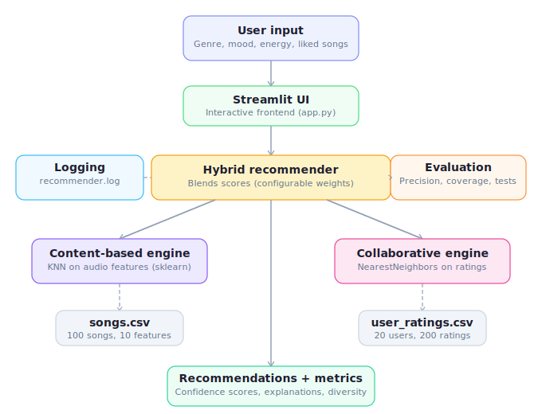

# 🎵 TuneRanker — Hybrid Music Recommendation System

## Original Project

This project builds on the **Music Recommender Simulation** from Modules 1–3, which was a basic content-based song recommender using manual scoring rules. The original version scored songs with hand-tuned if/else logic based on genre, mood, and energy matching against a 10-song catalog.

## Summary

**TuneRanker** is a hybrid music recommendation engine that combines **content-based filtering** and **collaborative filtering** using scikit-learn to suggest songs based on a user's taste profile. It features confidence scoring on every recommendation, full explainability, evaluation metrics, comprehensive logging, and an interactive Streamlit frontend.

The system is designed as a portfolio-ready demonstration of ML-powered recommendation with a focus on **reliability and testing** — including 16 automated tests, precision/diversity/confidence metrics, and structured logging.

---

## Architecture Overview



The system has five main components:

1. **Streamlit UI** (`app.py`) — Interactive frontend where users set preferences (genre, mood, energy, acoustic preference) and select songs they already like. Displays recommendations as styled cards with scores and explanations.

2. **Hybrid Recommender** (`src/recommender.py`) — Orchestrates both engines. Accepts a `UserProfile` and optional liked song IDs, queries both engines, blends their scores with configurable weights, computes confidence, and generates plain-English explanations.

3. **Content-Based Engine** — Uses scikit-learn's `NearestNeighbors` with cosine distance on standardized audio features (energy, tempo, valence, danceability, acousticness). Finds songs that *sound* similar to user preferences, with genre/mood bonuses.

4. **Collaborative Filtering Engine** — Builds a song × user rating matrix from `user_ratings.csv` and uses `NearestNeighbors` to find songs that users with similar taste enjoyed. Returns items the current user hasn't rated yet.

5. **Evaluation Module** — Functions for Precision@K, genre diversity, average confidence, and catalog coverage. These are used in both the test suite and the CLI runner to measure system quality.

**Data flows:** User input → Streamlit → HybridRecommender → (ContentEngine + CollaborativeEngine in parallel) → weighted blend → ranked Recommendation objects with confidence + explanation → displayed in UI.

---

## Setup Instructions

### Prerequisites
- Python 3.9+
- pip

### Installation

1. Clone the repository:
   ```bash
   git clone https://github.com/YOUR_USERNAME/Music-Recommender-Simulation.git
   cd Music-Recommender-Simulation
   ```

2. Create a virtual environment (recommended):
   ```bash
   python -m venv .venv
   source .venv/bin/activate      # Mac/Linux
   .venv\Scripts\activate         # Windows
   ```

3. Install dependencies:
   ```bash
   pip install -r requirements.txt
   ```

### Running the App

**Streamlit UI (recommended):**
```bash
streamlit run app.py
```
Then open `http://localhost:8501` in your browser.

**Command-line mode:**
```bash
python -m src.main
```

### Running Tests

```bash
pytest tests/ -v
```

---

## Sample Interactions

### Example 1: Happy Pop Listener
**Input:** Genre = pop, Mood = happy, Energy = 0.80, Liked songs = Sunrise City, Gym Hero, Dance Floor Fever

**Output:**
| # | Song | Artist | Hybrid Score | Confidence |
|---|------|--------|-------------|------------|
| 1 | Euphoria | Max Pulse | 1.236 | 100% |
| 2 | Weekend Vibes | Neon Echo | 1.236 | 100% |
| 3 | Glitter Bomb | Max Pulse | 1.232 | 99.7% |
| 4 | Firework | Neon Echo | 1.213 | 98.2% |
| 5 | Heartbeat City | Neon Echo | 1.109 | 89.7% |

*Explanation for #1:* "Recommended because it matches your favorite genre exactly, matches your preferred mood, energy level is a very close match, fits your non-acoustic preference, highly danceable, upbeat feel, liked by users with similar taste."

### Example 2: Chill Lofi Listener
**Input:** Genre = lofi, Mood = chill, Energy = 0.40, Liked songs = Midnight Coding, Library Rain, Focus Flow

**Output:**
| # | Song | Artist | Hybrid Score | Confidence |
|---|------|--------|-------------|------------|
| 1 | Afterglow | LoRoom | 0.949 | 100% |
| 2 | Daydream | LoRoom | 0.868 | 91.5% |
| 3 | Study Session | LoRoom | 0.861 | 90.7% |
| 4 | Homework Beats | LoRoom | 0.859 | 90.5% |
| 5 | Pillow Fort | LoRoom | 0.789 | 83.2% |

### Example 3: Intense Rock Listener
**Input:** Genre = rock, Mood = intense, Energy = 0.90, Liked songs = Storm Runner, Thunder Road, Rebel Yell

**Output:**
| # | Song | Artist | Hybrid Score | Confidence |
|---|------|--------|-------------|------------|
| 1 | Adrenaline | Voltline | 1.209 | 100% |
| 2 | Revolution | Voltline | 1.207 | 99.8% |
| 3 | Concrete Jungle | Voltline | 1.205 | 99.7% |
| 4 | Wildfire | Voltline | 1.200 | 99.3% |
| 5 | Crown | Voltline | 1.160 | 96.0% |

---

## Design Decisions

**Why hybrid over pure content-based?** Content-based filtering alone creates a "more of the same" problem — it only finds songs that sound similar. Adding collaborative filtering surfaces songs that users with similar taste enjoyed, even if the audio features differ. This catches cross-genre discoveries that content-only would miss.

**Why scikit-learn over deep learning?** The dataset is small (100 songs, 20 users), which makes deep learning overkill and hard to evaluate. Scikit-learn's KNN and NearestNeighbors are interpretable, fast, and appropriate for the data scale. Every decision the model makes can be explained in plain English.

**Why configurable weights?** Different users benefit from different blends. A new user with no liked songs gets 100% content-based. A returning user with many ratings benefits more from collaborative filtering. The Streamlit UI exposes this as a slider so users (and evaluators) can see the effect.

**Trade-offs:**
- The synthetic dataset means results aren't validated against real listening behavior
- Collaborative filtering with only 20 simulated users is sparse — real systems have millions
- The system doesn't learn from feedback within a session
- Genre/mood are categorical strings — a real system would embed them

---

## Testing Summary

**16 out of 16 tests passed.** The test suite covers:

- **Data loading** (3 tests): CSV parsing, field types, missing file handling
- **Content engine** (3 tests): Result count, genre ranking correctness, similarity symmetry
- **Collaborative engine** (2 tests): Recommendation generation, graceful empty-ratings handling
- **Hybrid recommender** (3 tests): Output structure, empty catalog error, score ordering
- **Confidence scoring** (2 tests): Bounds checking, monotonic ordering
- **Evaluation metrics** (3 tests): Diversity calculation, empty-list edge case, precision bounds

**Evaluation metrics from the CLI runner:**
- Precision@5 (pop user vs pop songs): **1.00** — all 5 recommendations were pop songs
- Genre diversity (pop user): **0.20** — low diversity expected since the user wants pop
- Average confidence: **0.975** — the model is very confident in its top picks

The system logs every recommendation request, engine fit, and evaluation metric to `logs/recommender.log` with timestamps.

---

## Reflection

Building this project taught me that recommendation systems are fundamentally about **trade-offs**. Precision vs. diversity is the core tension — a system that always recommends exactly what you asked for is accurate but boring. The most interesting engineering challenge was blending two different signal sources (audio features vs. user behavior) into a single ranked list.

I was surprised by how much the weight slider matters. Moving from 60/40 content/collab to 90/10 completely changes the character of recommendations — it shifts from "songs similar users liked" to "songs that sound like what you described." Neither is wrong, but they serve different needs.

Working with scikit-learn's NearestNeighbors reinforced that simple algorithms with good features often outperform complex ones with poor features. The feature engineering (standardizing audio features, adding genre/mood bonuses) mattered more than the choice of algorithm.

---

## Demo Walkthrough

> **TODO:** Record a Loom video showing the Streamlit app with 2–3 user profiles and add the link here.

---

## Model Card

See [model_card.md](model_card.md) for the full reflection including limitations, bias analysis, and AI collaboration notes.
